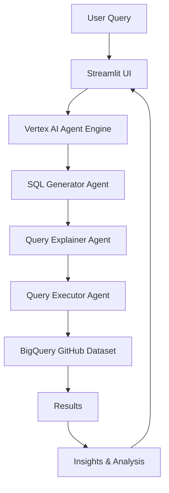

# 📁 Project Structure

```
dataops-adk-agent/
├── 📄 README.md                    # Project overview and quick start
├── 📖 DEVELOPERS_GUIDE.md          # Comprehensive developer documentation
├── 🐳 Dockerfile                   # Production container configuration
├── 🐙 docker-compose.yml           # Local development orchestration
├── 📦 pyproject.toml               # Python dependencies and project config
├── 🔒 .dockerignore                # Docker build exclusions
├── 🔒 .gitignore                   # Git exclusions
├── ⚙️ setup.sh                     # Quick setup script
├── 🏃 run_streamlit.sh             # Local Streamlit runner
├── 🐳 run_docker.sh                # Docker development runner
├── 🚀 run_production.sh            # Production deployment runner
├── 🔧 .env.docker                  # Docker environment configuration
├── 📝 .env.docker.example          # Docker environment template
│
├── 📁 agent-deployment/            # Agent deployment and testing
│   ├── 🚀 deploy.py                # Deploy agent to Vertex AI
│   └── 🧪 test_deployment.py       # Test deployed agent functionality
│
├── 📁 dataops/                     # Core agent implementation
│   ├── 🐍 __init__.py              # Package initialization
│   ├── 🤖 agent.py                 # Main agent pipeline (3-stage)
│   ├── 🛠️ tools.py                 # BigQuery tools and utilities
│   ├── 📝 prompt.py                # Dynamic prompt management
│   ├── ⚙️ .env                     # Environment configuration
│   ├── 📝 .env.example             # Environment template
│   ├── 🐳 Dockerfile               # Legacy container config
│   └── 📁 prompt-template/         # Jinja2 prompt templates
│       ├── 📄 github_analysis_example.j2    # SQL query examples
│       ├── 📊 github_table_structure.j2     # BigQuery schema info
│       └── 📋 github_repos_tables.json      # Complete table definitions
│
├── 📁 infra/                       # Infrastructure as Code (Terraform)
│   ├── 🏗️ main.tf                  # Primary resource definitions
│   ├── 📝 variables.tf             # Input variable declarations
│   ├── 📤 outputs.tf               # Output value definitions
│   ├── ⚙️ provider.tf              # Terraform provider configuration
│   └── 🔧 terraform.tfvars         # Variable values (environment-specific)
│
└── 📁 app/                         # Web application
    └── 🌐 app.py                   # Streamlit web interface
```

## 📋 File Descriptions

### 🔧 **Configuration Files**
- **pyproject.toml**: Python project configuration, dependencies managed by UV
- **docker-compose.yml**: Multi-container application orchestration
- **Dockerfile**: Production-ready container image definition
- **.env files**: Environment-specific configuration variables

### 🤖 **Core Agent** (`dataops/`)
- **agent.py**: 3-stage Sequential Agent pipeline implementation
- **tools.py**: BigQuery integration and SQL execution utilities
- **prompt.py**: Dynamic Jinja2 template loading and management
- **prompt-template/**: SQL examples, schema definitions, and query templates

### 🚀 **Deployment** (`agent-deployment/`)
- **deploy.py**: Automated deployment to Vertex AI Agent Engine
- **test_deployment.py**: Interactive testing framework for deployed agents

### 🏗️ **Infrastructure** (`infra/`)
- **main.tf**: Google Cloud resources (APIs, IAM, storage, etc.)
- **variables.tf**: Configurable parameters for different environments
- **outputs.tf**: Important values from Terraform deployment
- **terraform.tfvars**: Environment-specific variable values

### 🌐 **Web Application** (`app/`)
- **app.py**: Interactive Streamlit interface with chat functionality

### 🏃 **Helper Scripts**
- **setup.sh**: One-command project initialization
- **run_streamlit.sh**: Local development server
- **run_docker.sh**: Containerized development environment
- **run_production.sh**: Production container deployment

## 🔄 Data Flow



## 🛠️ Development Workflow

1. **Setup**: Run `./setup.sh` for project initialization
2. **Configure**: Edit environment files with your Google Cloud settings
3. **Infrastructure**: Deploy with Terraform in `infra/`
4. **Agent**: Deploy to Vertex AI using `agent-deployment/deploy.py`
5. **Test**: Validate with `agent-deployment/test_deployment.py`
6. **Develop**: Run locally with `./run_streamlit.sh` or `./run_docker.sh`
7. **Deploy**: Production deployment with `./run_production.sh`

## 📊 Technology Integration

| Component | Technology | Purpose |
|-----------|------------|---------|
| **Agent Pipeline** | Google ADK | AI agent orchestration |
| **Data Processing** | BigQuery | GitHub repository analysis |
| **Web Interface** | Streamlit | Interactive user experience |
| **Containerization** | Docker | Consistent deployments |
| **Infrastructure** | Terraform | Cloud resource management |
| **Package Management** | UV | Fast Python dependencies |
| **Cloud Platform** | Google Cloud | Scalable hosting |