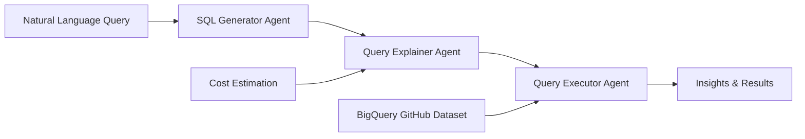

# 🔍 DataOps ADK Agent

> A powerful GitHub repository analysis agent built with Google's Agent Development Kit (ADK) that provides natural language insights into open-source repositories using BigQuery.

[](https://www.python.org/downloads/)
[](https://cloud.google.com/vertex-ai/docs/agent-builder)
[](https://streamlit.io/)
[](https://www.docker.com/)
[](https://www.terraform.io/)

## 🚀 Quick Start

### **🐳 Docker (Recommended)**
```bash
git clone <repository-url>
cd dataops-adk-agent

# Configure environment
cp .env.docker.example .env.docker
# Edit .env.docker with your Google Cloud settings

# Run with Docker
./run_docker.sh
```

### **💻 Local Development**
```bash
# Install dependencies
pip install uv
uv sync
source .venv/bin/activate

# Configure environment
cp dataops/.env.example dataops/.env
# Edit dataops/.env with your Google Cloud settings

# Run locally
streamlit run app/app.py
```

**🌐 Access the application at [http://localhost:8501](http://localhost:8501)**

## ✨ What This Agent Does

Ask natural language questions about GitHub repositories and get instant insights powered by BigQuery's massive GitHub dataset:

### 💬 Example Queries

- **"What are the top 10 languages by bytes for tensorflow/tensorflow?"**
- **"Find files in microsoft/vscode that contain the term 'TODO' and show snippets"**
- **"Who are the top committers in the last year for facebook/react?"**
- **"Show the top repositories by watch count"**
- **"Search for security-related code patterns across repositories"**

### 🔄 How It Works

1. **🧠 Natural Language Processing**: Converts your question into optimized BigQuery SQL
2. **💰 Cost Analysis**: Performs dry-run analysis and shows estimated costs
3. **✅ User Approval**: Asks for your permission before executing expensive queries
4. **📊 Smart Execution**: Runs the query and provides intelligent insights
5. **📈 Results Visualization**: Displays results in an easy-to-understand format

## 🏗️ Architecture


This project implements a sophisticated 3-stage AI agent pipeline:



### 🧩 Components

| Component | Purpose | Technology |
|-----------|---------|------------|
| **🤖 Agent Pipeline** | Core AI logic & orchestration | Google ADK, Python |
| **🌐 Web Interface** | Interactive user interface | Streamlit |
| **☁️ Cloud Deployment** | Scalable agent hosting | Vertex AI Agent Engine |
| **🏗️ Infrastructure** | Cloud resource management | Terraform, Google Cloud |
| **🐳 Containerization** | Consistent deployments | Docker, Docker Compose |

## 📊 Data Sources

**BigQuery Public Dataset**: `bigquery-public-data.github_repos`

- 📝 **265M+ commits** across open-source repositories
- 📄 **280M+ file contents** (text files under 1MB)
- 🗂️ **2.3B+ file metadata** entries
- 📦 **3.3M+ repositories** with detailed information
- 🏷️ **Programming languages**, licenses, and contributor data

## 🛠️ Technology Stack

### **Core Technologies**
- **🐍 Python 3.12+** - Modern Python with latest features
- **⚡ UV Package Manager** - Fast, reliable dependency management
- **🤖 Google ADK** - Agent Development Kit for AI agents
- **🎨 Streamlit** - Interactive web applications
- **🐳 Docker** - Containerization platform

### **Google Cloud Services**
- **🧠 Vertex AI Agent Engine** - Managed AI agent hosting
- **📊 BigQuery** - Serverless data warehouse
- **☁️ Cloud Storage** - Object storage for artifacts
- **🔐 IAM** - Identity and access management

### **Infrastructure & DevOps**
- **🏗️ Terraform** - Infrastructure as Code
- **🐙 Docker Compose** - Local development orchestration
- **📋 GitHub Actions** - CI/CD pipelines

## 🚀 Deployment Options

### **🐳 Local Docker Development**
Perfect for development and testing:
```bash
./run_docker.sh
```

### **☁️ Google Cloud Production**
Scalable cloud deployment:
```bash
# Deploy infrastructure
cd infra && terraform apply

# Deploy agent
cd agent-deployment && python deploy.py
```

### **🖥️ Local Development**
Direct Python execution:
```bash
source .venv/bin/activate
streamlit run app/app.py
```

## 📋 Prerequisites

### **Required Tools**
- **Python 3.12+** - [Download](https://www.python.org/downloads/)
- **UV Package Manager** - `pip install uv`
- **Docker** - [Install Docker](https://docs.docker.com/get-docker/)
- **Google Cloud CLI** - [Install gcloud](https://cloud.google.com/sdk/docs/install)

### **Google Cloud Setup**
1. **Create a Google Cloud Project**
2. **Enable required APIs**:
   - Vertex AI API
   - BigQuery API
   - Cloud Storage API
3. **Set up authentication**:
   - Service account or Application Default Credentials
4. **Configure IAM roles**:
   - BigQuery User
   - BigQuery Job User
   - AI Platform User

## 🔧 Configuration

### **Environment Variables**

Create `dataops/.env` (local) or `.env.docker` (Docker):

```env
# Google Cloud Configuration
GOOGLE_GENAI_USE_VERTEXAI=1
GOOGLE_CLOUD_PROJECT=your-project-id
GOOGLE_CLOUD_LOCATION=us-central1
GOOGLE_CLOUD_STORAGE_BUCKET=gs://your-bucket-name

# Agent Configuration (populated after deployment)
AGENT_ENGINE_ID=projects/.../locations/.../reasoningEngines/...
```

### **Terraform Variables**

Edit `infra/terraform.tfvars`:

```hcl
project_id = "your-project-id"
region = "us-central1"
agent_bucket_name = "your-unique-bucket-name"
```

## 🧪 Testing

### **Local Agent Testing**
```bash
cd dataops/
adk run  # Interactive testing
adk web  # Web interface testing
```

### **Deployed Agent Testing**
```bash
cd agent-deployment/
python test_deployment.py
```

### **Web Application Testing**
```bash
# Local testing
streamlit run app/app.py

# Docker testing
./run_docker.sh

# Production testing
./run_production.sh
```

## 📚 Documentation

- **📖 [Developer's Guide](DEVELOPERS_GUIDE.md)** - Comprehensive development documentation
- **🏗️ [Architecture Details](DEVELOPERS_GUIDE.md#-project-architecture)** - System design and components
- **🚀 [Deployment Guide](DEVELOPERS_GUIDE.md#-production-deployment)** - Production deployment instructions
- **🐛 [Troubleshooting](DEVELOPERS_GUIDE.md#-troubleshooting)** - Common issues and solutions

## 🤝 Contributing

We welcome contributions! Please see our [Developer's Guide](DEVELOPERS_GUIDE.md) for detailed information on:

- 🏗️ Project architecture and components
- 💻 Setting up the development environment
- 🧪 Running tests and validation
- 📦 Building and deploying changes
- 🐛 Debugging and troubleshooting

## 📄 License

This project is licensed under the MIT License - see the [LICENSE](LICENSE) file for details.

## 🆘 Support

- **📖 Documentation**: Check the [Developer's Guide](DEVELOPERS_GUIDE.md)
- **🐛 Issues**: Report bugs via GitHub Issues
- **💬 Discussions**: Join GitHub Discussions for questions
- **📧 Contact**: Reach out to the development team

## 🙏 Acknowledgments

- **Google Cloud** for the Agent Development Kit and BigQuery
- **GitHub** for the public repositories dataset
- **Streamlit** for the amazing web app framework
- **Open Source Community** for the tools and libraries used

---

**🔍 Ready to explore GitHub repositories like never before? Get started with DataOps ADK Agent today!** 